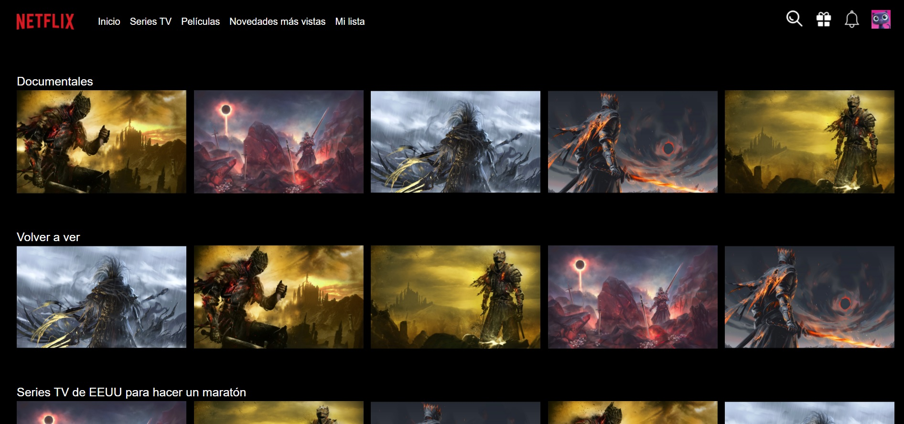

# Copia_Netflix

## Realizamos una copia del diseño de la página de Netflix.

Usamos `display:grid` para diseñar la página y colocar cada elemento en la posición que deseamos.

### -Diseño original de Netflix:

### -Diseño realizado en el reto:
